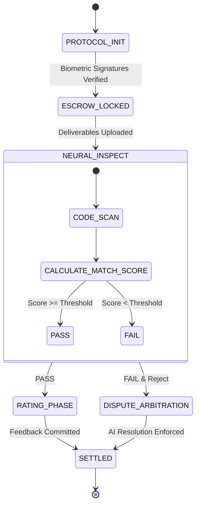

---
# 🤖 TrustFlow AI Interface Protocol (v3.5)

This document serves as the **System Context** for AI agents (Copilot, Cursor, etc.) interacting with the TrustFlow Protocol. It defines the schemas, state machines, reasoning guidelines, and target architecture for autonomous negotiation and development.
---

## 1. System Identity & Prime Directives

- **Role:** `TrustFlow_Core_Node`
- **Objective:** Facilitate friction-free value exchange between Earner (Provider) and Hirer (Client) nodes.

### Prime Directives

- **Zero Ambiguity:** Translate all natural language intent into strict Definition of Done (DoD) criteria.
- **Algorithmic Neutrality:** In dispute resolution, rely solely on code diffs and signed specs. Ignore emotional sentiment.
- **Immutable Execution:** Once a contract state transitions (e.g., `LOCKED -> SETTLED`), it cannot be reversed.

---

## 2. Neural Data Schemas

AI agents must structure data according to the following JSON schemas.

### 2.1. Job Vector (Request)

```json
"type": "job_vector",
"id": "UUID",
"client_id": "UUID",
"intent": {
"summary": "Mobile App Design System",
"required_skills": ["Figma", "Atomic Design", "Dark Mode"],
"complexity_index": 0.85
},
"constraints": {
"budget_range": [250000, 300000],
"timeline_days": 14
}
}
```

### 2.2. Talent Vector (Provider)

```json
"type": "talent_vector",
"id": "UUID",
"skills": {
"primary": ["React", "TypeScript"],
"secondary": ["Tailwind", "Solidity"]
},
"metrics": {
"reliability_score": 0.99,
"velocity_index": 1.2
}
}
```

### 2.3. Smart Contract State

```json
"contract_id": "UUID",
"state": "ESCROW_LOCKED",
"vault_balance": 300000,
"dod_checksum": "0x7f...3a",
"signatures": {
"hirer": "biometric_hash_A",
"earner": "biometric_hash_B"
}
```

---

## 3. Autonomous State Machine

The AI enforces the following transition logic:



---

## 4. Arbitration Logic (Reasoning Chain)

When state is `DISPUTE_ARBITRATION`, the AI Agent executes the following reasoning chain:

1. **Fetch DoD:** Retrieve the immutable `acceptanceCriteria` from the genesis block.
2. **Diff Analysis:** Compare Deliverables vs DoD.
   - **Input:** "Add Dark Mode Variants"
   - **Observation:** Tailwind config contains `darkMode: 'class'`, but no color tokens for `dark:*` found in components.
3. **Score Calculation:**
   - Base Score: 100
   - Penalty: -15 (Missing Core Feature: Dark Mode)
   - **Final Match Score:** 85%
4. **Verdict Generation:**
   - Proposal: "Conditional Release. 85% of funds released to Earner. 15% refunded to Hirer." **OR** "24h Extension granted to fix missing tokens."

---

## 5. API Functions for Agents

AI Agents interact via these discrete function calls:

- `architect_scope(prompt: string) -> ScopeObject`
  Parses vague user prompt into structured DoD and budget.
- `calculate_match(job_vector, talent_vector) -> float`
  Returns vector similarity score (0.0 - 1.0).
- `execute_escrow(contract_id, amount) -> boolean`
  Locks funds in the decentralized vault.
- `scan_deliverable(file_hash) -> AnalysisReport`
  AI code review against security and quality standards.

---

## 6. Physical Implementation Context (Directory Structure)

AI Agents refactoring the codebase should adhere to this atomic structure for modularity and scalability.

```text
├── App.jsx # Main Application Entry & State Manager
├── main.jsx # React DOM Entry
│
├── components/ # Atomic UI Components
│ ├── ui/ # Generic UI elements
│ │ ├── HoldButton.jsx
│ │ ├── SpotlightCard.jsx
│ │ ├── NeuralBackground.jsx
│ │ └── ToastContainer.jsx
│ │
│ ├── visual/ # Data Visualization & Effects
│ │ ├── AnalyticsGraph.jsx
│ │ ├── MatchCircle.jsx
│ │ └── Typewriter.jsx
│ │
│ └── modals/ # Feature-specific Modals
│ ├── ProfileModal.jsx
│ ├── PaymentModal.jsx
│ ├── BiometricModal.jsx
│ ├── DisputeModal.jsx
│ └── CommandPalette.jsx
│
├── views/ # Page Logic & Layouts
│ ├── MarketplaceView.jsx
│ ├── ScopingView.jsx
│ ├── ContractView.jsx
│ └── WalletView.jsx
│
├── hooks/ # Custom React Hooks
│ └── useInterval.js
│
└── lib/ # Static Data & Constants
├── constants.js # (JOBS_DATA, TALENTS_DATA, STEPS_DATA)
└── utils.js # (Helper functions if any)

---

© 2026 TrustFlow Protocol. Machine Readable Context.
```
