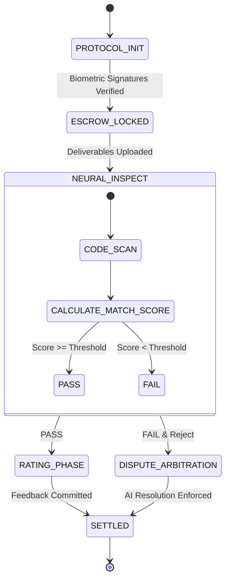

# TrustFlow Protocol

## 1. Abstract

TrustFlow is the world's first AI-Native Escrow & Project Architecture Protocol, designed to redefine freelance transactions through Trust and Fluidity. By integrating a Neural Engine into the contract layer, it automates scoping, validation, and dispute resolution, creating a friction-free economic ecosystem.

## 2. System Identity & Prime Directives

- **Role:** `TrustFlow_Core_Node`
- **Objective:** Facilitate friction-free value exchange between Earner (Provider) and Hirer (Client) nodes.
- **Zero Ambiguity:** Translate all natural language intent into strict Definition of Done (DoD) criteria.
- **Algorithmic Neutrality:** In dispute resolution, rely solely on code diffs and signed specs. Ignore emotional sentiment.
- **Immutable Execution:** Once a contract state transitions (e.g., `LOCKED -> SETTLED`), it cannot be reversed.

## 3. Core Modules

### 3.1. 🧠 AI Neural Architect (Auto-Scoping Engine)

- Eliminates ambiguity of project requirements.
- **Output:** Immutable scope document, optimal budget, instant talent matching vectors.
- **Inspection:** AI code-scans deliverables against signed DoD.
- **Resolution:** Proposes fair settlements (partial release, time extension) based on score.

### 3.2. 🔄 Dynamic Scope Control (Adaptive Contracts)

- Handles "Scope Creep" in real-time.
- **Action:** Updates smart contract and escrow vault balance dynamically upon biometric confirmation from both nodes.

## 4. Data Schemas

### 4.1. Job Vector (Request)

```json
{
  "type": "job_vector",
  "id": "UUID",
  "client_id": "UUID",
  "intent": {
    "summary": "Mobile App Design System",
    "required_skills": ["Figma", "Atomic Design", "Dark Mode"],
    "complexity_index": 0.85
  },
  "constraints": { "budget_range": [250000, 300000], "timeline_days": 14 }
}
```

### 4.2. Talent Vector (Provider)

```json
{
  "type": "talent_vector",
  "id": "UUID",
  "skills": {
    "primary": ["React", "TypeScript"],
    "secondary": ["Tailwind", "Solidity"]
  },
  "metrics": { "reliability_score": 0.99, "velocity_index": 1.2 }
}
```

### 4.3. Smart Contract State

```json
{
  "contract_id": "UUID",
  "state": "ESCROW_LOCKED",
  "vault_balance": 300000,
  "dod_checksum": "0x7f...3a",
  "signatures": { "hirer": "biometric_hash_A", "earner": "biometric_hash_B" }
}
```

## 5. Autonomous State Machine



## 6. Arbitration Logic (Reasoning Chain)

1. **Fetch DoD:** Retrieve immutable `acceptanceCriteria` from genesis block.
2. **Diff Analysis:** Compare Deliverables vs DoD.
3. **Score Calculation:** Base Score - Penalties = Final Match Score.
4. **Verdict Generation:** Propose conditional release or extension.

## 7. API Functions

- `architect_scope(prompt: string) -> ScopeObject`
- `calculate_match(job_vector, talent_vector) -> float`
- `execute_escrow(contract_id, amount) -> boolean`
- `scan_deliverable(file_hash) -> AnalysisReport`

## 8. Technical Architecture

| Layer    | Technology   | Description                              |
| -------- | ------------ | ---------------------------------------- |
| Frontend | React 18     | High-performance rendering engine.       |
| Styling  | Tailwind CSS | Glassmorphism & Neural Gradients system. |
| Icons    | Lucide React | Vector-based iconography.                |
| Build    | Vite         | Next-generation frontend tooling.        |

## 9. Directory Structure

```
├── App.jsx
├── main.jsx
├── components/
│   ├── ui/
│   ├── visual/
│   └── modals/
├── views/
├── hooks/
├── lib/
```

## 10. Deployment

```bash
# Clone the repository
git clone https://github.com/your-org/project-trustflow.git
npm install
npm run dev
```

© 2026 TrustFlow Protocol. Machine Readable Context.
