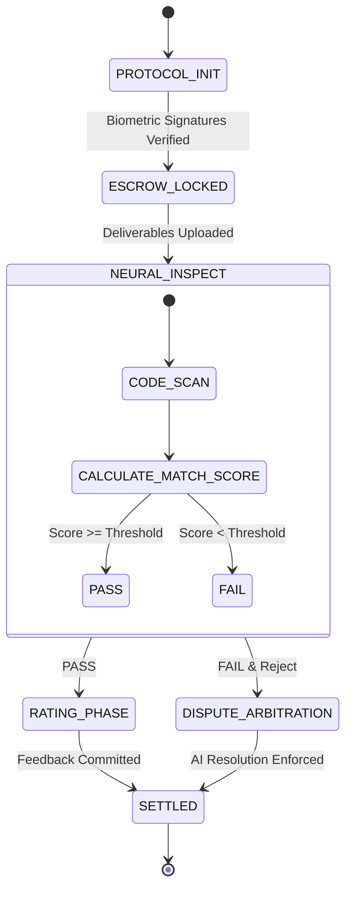

# Edge Case & Exception Handling: UI/Logic Implementation Plan

## Overview

This section outlines the implementation plan for adding edge case and exception handling features to the Trust Flow demo, enabling users to experience non-ideal scenarios and robust contract management.

## 1. Mid-Contract Cancellation

- Display a "Cancel" button during each contract phase (only enabled while contract is active).
- On cancel, show a confirmation dialog and record the cancellation reason in the contract history.
- After cancellation, set contract progress to "Cancelled" and lock further actions.

## 2. Payment Delay/Failure Simulation

- Add a "Simulate Payment Delay" button during the payment phase.
- When triggered, show a toast notification and record "Payment Delay Occurred" in history.
- Provide "Retry" and "Contact Admin" buttons for further action.

## 3. Renegotiation & Terms Modification

- Display a "Renegotiate" button while contract is active.
- On click, open a modal for modifying terms (deadline, amount, scope, etc.), and record changes in history.
- During renegotiation, pause contract progress; resume only after mutual agreement.

## 4. Multiple Rejections & Forced Dispute

- Track the number of rejections; after a threshold, automatically transition to dispute or display an "Admin Intervention" button.

## 5. Pause & Resume

- Add a "Pause" button to temporarily halt contract progress, and a "Resume" button to return to the previous phase.
- Record pause/resume actions in history.

## 6. Admin Intervention (Demo Only)

- When a dispute or exception occurs, display an "Admin Intervention" button to forcibly end or resume the contract.

## 7. Contract Workflow Stages & Edit Terms/Cancel Timing

1. DoD / Acceptance Protocol Presentation:

- The user is explicitly presented with three options: "Edit Terms", "Cancel", and "Initiate Contract".
- Edit Terms and Cancel are only available at this stage.

2. Commitment Locked:

- Both parties' trust, responsibilities, and terms are finalized; contract content is irreversible and maximally transparent.
- After locking, term changes and cancellations are not permitted in principle.
- Exceptions (emergency amendments or terminations) are handled through a separate mutual re-agreement flow or administrator approval.

### Rationale

- Allowing term changes or cancellations after locking undermines the contract's value, trust, and legal stability.
- The ideal UX is "zero ambiguity, full confidence." All adjustments and cancellations must be completed before locking; after locking, both parties focus solely on execution.
- This rule is consistent with global contract protocols across finance, law, and Web3.

For implementation details and UI/UX guidelines, see TrustFlow_Development_Roadmap.md.

---

# TrustFlow Protocol

## 1. Abstract

TrustFlow is the world's first AI-Native Escrow & Project Architecture Protocol, designed to redefine freelance transactions through Trust and Fluidity. By integrating a Neural Engine into the contract layer, it automates scoping, validation, and dispute resolution, creating a friction-free economic ecosystem.

## 2. System Identity & Prime Directives

- **Role:** `TrustFlow_Core_Node`
- **Objective:** Facilitate friction-free value exchange between Earner (Provider) and Hirer (Client) nodes.
- **Zero Ambiguity:** Translate all natural language intent into strict Definition of Done (DoD) criteria.
- **Algorithmic Neutrality:** In dispute resolution, rely solely on code diffs and signed specs. Ignore emotional sentiment.
- **Immutable Execution:** Once a contract state transitions (e.g., `LOCKED -> SETTLED`), it cannot be reversed.

## 3. Core Modules

### 3.1. 🧠 AI Neural Architect (Auto-Scoping Engine)

- Eliminates ambiguity of project requirements.
- **Output:** Immutable scope document, optimal budget, instant talent matching vectors.
- **Inspection:** AI code-scans deliverables against signed DoD.
- **Resolution:** Proposes fair settlements (partial release, time extension) based on score.

### 3.2. 🔄 Dynamic Scope Control (Adaptive Contracts)

- Handles "Scope Creep" in real-time.
- **Action:** Updates smart contract and escrow vault balance dynamically upon biometric confirmation from both nodes.

## 4. Data Schemas

### 4.1. Job Vector (Request)

```json
{
  "type": "job_vector",
  "id": "UUID",
  "client_id": "UUID",
  "intent": {
    "summary": "Mobile App Design System",
    "required_skills": ["Figma", "Atomic Design", "Dark Mode"],
    "complexity_index": 0.85
  },
  "constraints": { "budget_range": [250000, 300000], "timeline_days": 14 }
}
```

### 4.2. Talent Vector (Provider)

```json
{
  "type": "talent_vector",
  "id": "UUID",
  "skills": {
    "primary": ["React", "TypeScript"],
    "secondary": ["Tailwind", "Solidity"]
  },
  "metrics": { "reliability_score": 0.99, "velocity_index": 1.2 }
}
```

### 4.3. Smart Contract State

```json
{
  "contract_id": "UUID",
  "state": "ESCROW_LOCKED",
  "vault_balance": 300000,
  "dod_checksum": "0x7f...3a",
  "signatures": { "hirer": "biometric_hash_A", "earner": "biometric_hash_B" }
}
```

## 5. Autonomous State Machine



## 6. Arbitration Logic (Reasoning Chain)

1. **Fetch DoD:** Retrieve immutable `acceptanceCriteria` from genesis block.
2. **Diff Analysis:** Compare Deliverables vs DoD.
3. **Score Calculation:** Base Score - Penalties = Final Match Score.
4. **Verdict Generation:** Propose conditional release or extension.

## 7. API Functions

- `architect_scope(prompt: string) -> ScopeObject`
- `calculate_match(job_vector, talent_vector) -> float`
- `execute_escrow(contract_id, amount) -> boolean`
- `scan_deliverable(file_hash) -> AnalysisReport`

## 8. Technical Architecture & Coding Standards

| Layer     | Technology       | Description                                   |
| --------- | ---------------- | --------------------------------------------- |
| Frontend  | React 18         | High-performance rendering engine.            |
| Styling   | Tailwind CSS     | Glassmorphism & Neural Gradients system.      |
| Icons     | Lucide React     | Vector-based iconography.                     |
| Build     | Vite             | Next-generation frontend tooling.             |
| Utilities | src/lib/utils.js | Shared utility functions for formatting, etc. |

### Coding Standards

- All number formatting (e.g., points, rates, balances) must use `formatNumber` from `src/lib/utils.js` for consistency and localization.
- Date formatting should use `formatDate` from `src/lib/utils.js`.
- String truncation and array uniqueness should use `truncate` and `uniqueArray` utilities, respectively.
- Utility functions are imported and used in all relevant components and views (see App.jsx, WalletView.jsx, MarketplaceView.jsx, etc.).

This ensures robust, maintainable, and locale-consistent UI logic across the codebase.

## 9. Directory Structure

```
├── App.jsx
├── main.jsx
├── components/
│   ├── ui/
│   ├── visual/
│   └── modals/
├── views/
├── hooks/
├── lib/
```

## 10. Deployment

```bash
# Clone the repository
git clone https://github.com/your-org/project-trustflow.git
npm install
npm run dev
```

© 2026 TrustFlow Protocol. Machine Readable Context.
